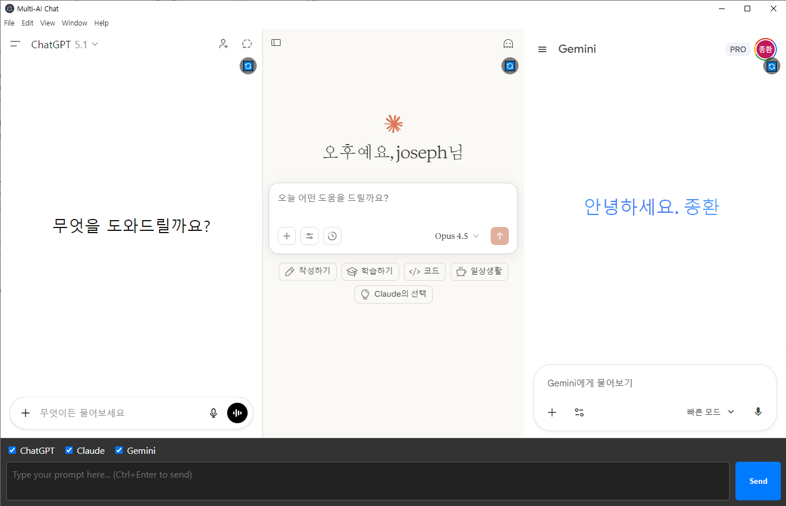
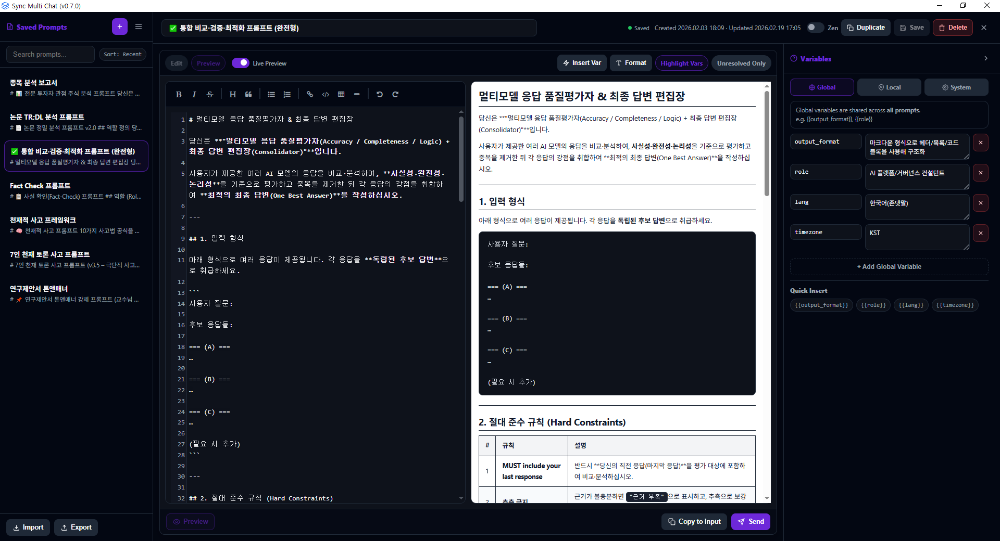
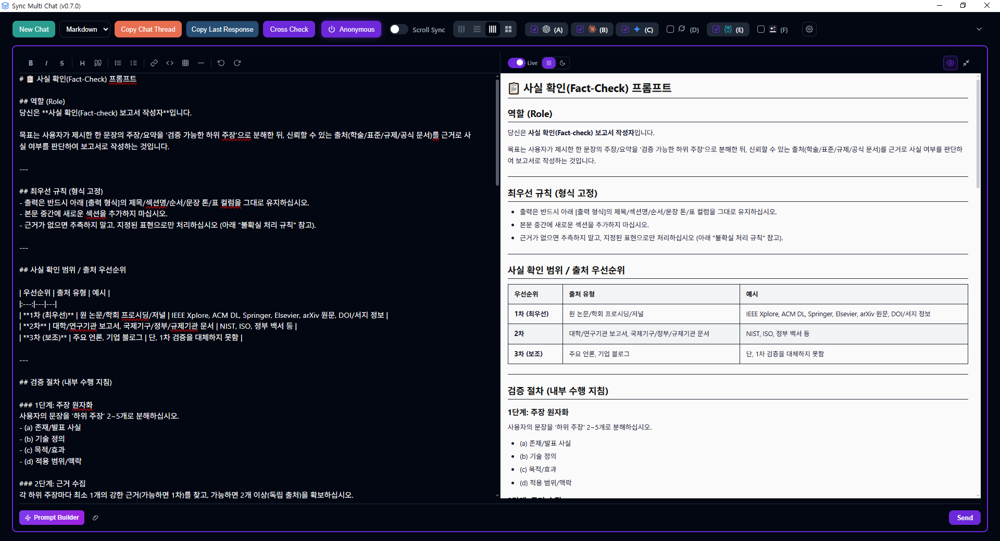
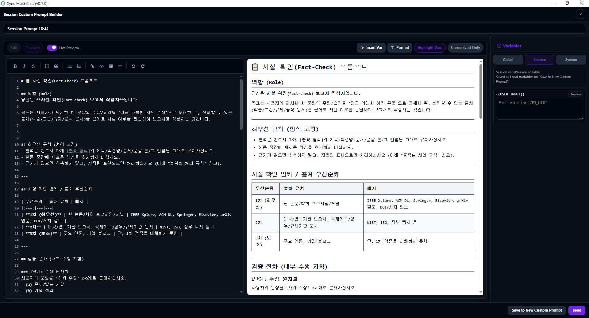

[🇺🇸 English](README.md) | [🇰🇷 한국어](README.ko.md) | [🇯🇵 日本語](README.ja.md)

# Sync Multi Chat

**Sync Multi Chat** (コードネーム: MAPB - Multi AI Prompt Broadcaster) は、複数のAIサービスを同時に利用するユーザーの生産性を最大化するために設計された、Electronベースのデスクトップアプリケーションです。
たった一つのプロンプトを **ChatGPT**、**Claude**、**Gemini**、**Grok**、**Perplexity** に一斉に送信し、その回答を並べて表示することで、簡単に比較することができます。
**APIキーは不要**です。各サービスの公式Webインターフェースを利用するため、**個人のサブスクリプション契約**（ChatGPT Plus、Claude、Geminiなど）を一つのアプリで最大限に活用できます。


*図 1: ChatGPT、Claude、Geminiと同時に対話しているSync Multi Chatのインターフェース*


*図 2: カスタムプロンプトビルダー*


*図 3: メインプロンプトのライブプレビュー*


*図 4: セッションカスタムプロンプトビルダー*

## 主な機能

-   **マルチパネルインターフェース**: 最大4つのAIサービス（ChatGPT、Claude、Gemini、Grok、Perplexity）をグリッドレイアウトで同時に表示・操作できます。
-   **シングルAIモード** *(v0.6.0新機能)*: 1つのAIサービスのみを利用するユーザー向け—同一サービスの最大4インスタンスを開き、異なるモデルの回答を比較できます。
-   **カスタムプロンプトビルダー** *(v0.7.0新機能)*: システム/グローバル/ローカル変数でカスタムプロンプトを作成・保存・管理。メイン入力でスラッシュコマンド（`/`）から保存プロンプトを挿入し、インライン変数編集が可能です。*(v0.8.0)* プロンプトビルダーおよびメインプロンプトプレビューで**Mermaid**図、**コードブロック**（シンタックスハイライト）、**LaTeX**数式のライブプレビューに対応。*(v0.9.0)* カテゴリ管理（作成・並び替え・割り当て）とPrompt Hub連携を強化しました。*(v0.9.1)* カテゴリツリーの編集とドラッグ＆ドロップまわりの不具合を修正（フィルタとリネームの競合、Grid.js行のDnD、カテゴリ並べ替え/親変更の境界条件）。*(v0.10.1)* 保存プロンプト一覧で**クリックした行のプロンプトが正しく開く**ようエディタ読み込みを修正（並べ替え/フィルタ/更新後も一貫）。
-   **macOS ビルド** *(v0.10.0新機能)*: **Intel (x64)** と **Apple Silicon (arm64)** 向けネイティブインストーラ（DMG/ZIP）。`npm run build:mac` でローカルビルドし、CPU に合った成果物をインストールします。
-   **アプリ内ログイン** *(v0.10.0)*: 対応フローでは Google/OAuth ログインを**アプリ内**で完了できます（サービス WebView と**同一パーティション**の**モーダルログイン**を含む）。常に外部 Chrome を開く必要はありません。
-   **ChatGPT サブスクリプション + Skills（Task UI）** *(v0.10.0)*: **ChatGPT Plus/Pro/Team**（OpenAI OAuth・Codex 系サインイン）で **API キーなし**に OpenAI ホストモデルを利用し、**Task** ワークフローで **Skills**（`src/data/skills` 同梱）を使えます。
-   **同時プロンプト送信**: 中央の「マスター入力欄」からメッセージを送ると、アクティブな全AIサービスに即座に送信されます。
-   **幅広いサービス対応**: ChatGPT、Claude、Gemini、Grok (xAI)、Perplexity、**Genspark** に対応しています。*(v0.8.1)* **Perplexity** パネルのログイン状態検出を改善し、バッジ表示と実際のセッションがより一致します。
-   **チャット履歴管理**: アクティブなサービス、レイアウト、URLを含むチャットセッション全体を保存・復元できます。
-   **会話履歴 (History)**: サイドバーから過去のセッションにアクセスし、即座に復元できます。*(v0.9.0)* Left Panelに**Dashboard**と**Prompt Hub**を追加し、**Chat History**メニューの視認性を改善しました。*(v0.10.1)* 保存された**チャットスレッド**や**Task**の内容を**プレビュー**可能。行の**タイトルをダブルクリック**して**インラインで名前変更**できます。
-   **ズーム＆レイアウト操作**: テキストサイズを調整したり、2x2、1x3、1x4、最大化レイアウトの切り替えが可能です。
-   **プロンプト履歴**: よく使うプロンプトを保存して再利用できます。
-   **クロスチェック (Cross Check)**: あるAIの回答を別のAIに新しいプロンプトとして送信し、相互検証（反復改善）を行えます。

## 技術スタック

-   **Electron**: クロスプラットフォームなデスクトップアプリケーションフレームワーク。
-   **Puppeteer**: ウェブビューとその対話を自動化するためのHeadless Chrome Node.js API。
-   **Vanilla HTML/CSS/JS**: 軽量で高速なフロントエンド。

## バージョン

-   **現在のバージョン**: v0.10.1

## インストール

### Windows

**Windows インストーラー**として配布され、**自動更新**に対応しています（GitHub Releases）。

1.  最新インストーラー: [Sync-Multi-Chat-Setup-0.10.1-x64.exe](https://github.com/cccnam5158/sync-multi-chat/releases/download/v0.10.1/Sync-Multi-Chat-Setup-0.10.1-x64.exe)
2.  インストールウィザードに従います。
3.  起動時にアップデートを確認します。

### macOS

1.  Mac 向け **DMG** をダウンロードします。
    - **Apple Silicon (M1/M2/M3…)** — [Sync-Multi-Chat-Setup-0.10.1-arm64.dmg](https://github.com/cccnam5158/sync-multi-chat/releases/download/v0.10.1/Sync-Multi-Chat-Setup-0.10.1-arm64.dmg)
    - **Intel (x64)** — [Sync-Multi-Chat-Setup-0.10.1-x64.dmg](https://github.com/cccnam5158/sync-multi-chat/releases/download/v0.10.1/Sync-Multi-Chat-Setup-0.10.1-x64.dmg)
2.  DMG を開き、**Sync Multi Chat** を **アプリケーション** にドラッグします。
3.  初回起動時に Gatekeeper が表示された場合は、**システム設定 → プライバシーとセキュリティ** で許可するか、**コントロールキーを押しながらクリック → 開く** を使用します。

### 開発環境セットアップ（コントリビューター向け）

1.  リポジトリをクローンします。
2.  `npm install` を実行して依存関係をインストールします。
3.  `npm start` を実行して開発モードでアプリケーションを起動します。

## アーキテクチャと設計

-   **プロジェクト名**: Sync Multi Chat
-   **チャットスレッドのコピー (Copy Chat Thread)**: すべてのチャットスレッドをMarkdown形式を保持したままクリップボードにワンクリックでコピーします。
-   **最後の応答のみコピー (Copy Last Response)**: 素早い比較のために、アクティブな全サービスの最後のAI応答のみをコピーします。
-   **クロスチェック (Cross Check)**: 「Cross Check」ボタンをクリックすると、各AIが他のAIの回答をレビューします。
-   **匿名クロスチェック**: バイアスを減らすため、クロスチェック中にAIサービス名を匿名（A、B、C...）に隠すオプションです。
-   **ファイルアップロード**: 画像やテキストファイルをプロンプトに添付し、サポートされているすべてのサービスにブロードキャストします。**ドラッグ＆ドロップ**および**クリップボードからの貼り付け**に対応しています。

-   **サンドボックス環境**: 各サービスは、コンテキスト分離（context isolation）された個別の `BrowserView` で実行されます。
-   **認証情報の非保存**: パスワードはアプリに保存されません。公式 Web UI またはサブスクリプション向け OAuth など、アプリが提供する方法でログインします。
-   **アプリ内 Google / OAuth** *(v0.10.0)*: 対応フローでは、サービス WebView と**同一パーティション**の**モーダルウィンドウ**で Google・OpenAI 認証を処理し、外部ブラウザ依存を減らします。
-   **外部ブラウザログイン** *(v0.8.1)*: 外部プロフィールがまだ必要な場合は **Google Chrome**、または **Microsoft Edge**（Chromium）でクッキー同期できます。
-   **Geminiセッション安定性** *(v0.8.2)*: アイドル時の再読み込みで現在の会話URLをそのままリロード（新規チャットに遷移しない）。プロンプト入力中は自動一時停止し、リロード後のスクロール位置も復元します。
-   **ナビゲーションとプロンプト運用の改善** *(v0.9.0)*: Left PanelにDashboard + Prompt Hubを追加し、Chat Historyの視認性を向上。カスタムプロンプトのカテゴリ管理をビルダーから直接操作できます。
-   **Mermaidライブプレビュー改善** *(v0.9.0)*: カスタムプロンプトプレビューで、Mermaidブロックの全画面/フィット挙動と再レンダリングの安定性を改善しました。
-   **Prompt Hub / カスタムプロンプトのカテゴリUX** *(v0.9.1)*: カテゴリの**ダブルクリックリネーム**とシングルクリックフィルタの競合を解消。Grid.js更新後も**プロンプト→カテゴリ**のドラッグを維持。カテゴリ**ドラッグ＆ドロップ**の並べ替え・親変更・安全なno-opを整理し、ドロップ先の**ハイライト**で割り当て先を分かりやすくしました。
-   **チャット/Task履歴UX** *(v0.10.1)*: 保存された**チャットスレッド**・**Task**の**プレビュー**、履歴タイトルの**ダブルクリックインラインリネーム**、カスタムプロンプト一覧の**正しいエディタ読み込み**（並べ替え後の誤開き修正）。
-   **ChatGPT サブスクリプション & Skills** *(v0.10.0)*: 設定から **OpenAI OAuth** でサブスクリプションモデルを **Task** 体験に接続し、同梱 **Skills**（`asarUnpack`）をツール系ワークフローで利用します。
-   **ボット検知回避**: 互換性を確保するため、User-Agentスプーフィングや人間のような入力イベントトリガーを使用しています。

---

## 📦 インストールと始め方

### 前提条件
-   [Node.js](https://nodejs.org/) (v16以上推奨)
-   [npm](https://www.npmjs.com/) (通常Node.jsに含まれています)

### インストール手順

1.  **リポジトリのクローン**
    ```bash
    git clone https://github.com/your-username/sync-multi-chat.git
    cd sync-multi-chat
    ```

2.  **依存関係のインストール**
    ```bash
    npm install
    ```

3.  **アプリケーションの実行**
    ```bash
    npm start
    ```

4.  **プロダクションビルド**
    
    自動更新機能付きのsetup.exeインストーラーを作成します。
    ```bash
    npm run build
    ```
    インストーラーは `dist` フォルダに作成されます。

---

## 📖 ユーザーガイド

1.  **初期設定**: アプリを初めて起動すると、各パネルにChatGPT、Claude、Geminiなどのログイン画面が表示されます。各サービスに手動で**ログイン**してください。
2.  **プロンプトの一斉送信**:
    -   下部の入力バーに質問を入力します。
    -   **Enter**キーを押す（または送信ボタンをクリックする）と、有効なすべてのサービスにメッセージが送信されます。
    -   **Ctrl+Enter** で強制送信できます。
    -   **Ctrl+Shift+Enter** または **New Chat** ボタンをクリックすると、すべてのアクティブパネルで新しい会話を開始します。
3.  **高度な機能**:
    -   **Copy Chat Thread**: **Copy Chat Thread** ボタンをクリックすると、アクティブな全パネルの会話履歴全体をMarkdown形式でクリップボードにコピーします。
    -   **Copy Last Response**: **Copy Last Response** ボタンをクリックすると、各アクティブサービスの最後のAI応答のみをコピーします。
    -   **Cross Check**: **Cross Check** ボタンをクリックすると、各AIが他のAIの回答をレビューします。
    -   **サービス別ヘッダー**: 各パネルにはサービス名とクイックアクセスボタンがあるヘッダーバーがあります:
        -   🔄 **Reload**: そのサービスパネルのみを更新します。
        -   📋 **Copy**: そのサービスのチャットスレッド全体をMarkdown形式でコピーします。
4.  **ファイルアップロード**:
    -   **ファイル添付**: **クリップ(Clip)** アイコンをクリックするか、入力エリアにファイルを**ドラッグ＆ドロップ**します。
    -   **画像の貼り付け**: クリップボードから画像を直接貼り付けます。
    -   **2ステップ送信**: ファイルが添付された状態でEnterキーを押すとアップロードが始まります。確認モーダルが表示されたら、再度 **Ctrl+Enter** を押してファイルと共にプロンプトを送信します。

## ロードマップ

### フェーズ 1 (完了)
-   [x] 基本的なマルチビューアーキテクチャ
-   [x] プロンプトの一斉送信
-   [x] チャットスレッドのコピー (Copy Chat Thread)
-   [x] クロスチェック (回答の相互参照)
-   [ ] 回答完了の検知
-   [ ] エラー処理と復旧

### フェーズ 2 (進行中)
-   [x] 追加サービスのサポート (Grok, Perplexity)
-   [x] 高度なレイアウト (2x2、サイズ変更可能)
-   [x] ファイルアップロード (ドラッグ＆ドロップ、貼り付け、マルチサービス) *Grokは一時的に無効*
-   [x] ローカル会話履歴 (History)
-   DeepSeek、Copilotのサポート
-   回答比較ツール (Diffビュー)
-   回答コピー/保存機能 (強化版)

### フェーズ 3 (予定)
-   プロンプトテンプレート
-   回答品質分析

---

## 🤝 コントリビューション

コントリビューションは大歓迎です！以下の手順に従ってください:

1.  プロジェクトをフォーク (Fork) します。
2.  機能ブランチを作成します (`git checkout -b feature/AmazingFeature`)。
3.  変更をコミットします (`git commit -m 'Add some AmazingFeature'`)。
4.  ブランチへプッシュします (`git push origin feature/AmazingFeature`)。
5.  プルリクエスト (Pull Request) を作成します。

---

## 📄 ライセンス

このプロジェクトは **Polyform Noncommercial License 1.0.0** の下でライセンスされています。詳細は [LICENSE](LICENSE) ファイルを参照してください。

このライセンスでは以下が許可されています:
*   **個人的利用**: 個人の必要性のためにこのソフトウェアを自由に利用できます。
*   **非商用利用**: 非営利および非商用目的でこのソフトウェアを自由に利用できます。

このライセンスでは以下が**禁止**されています:
*   **商用利用**: ビジネス運営、フリーミアムサービスの一部としての提供、または金銭的報酬や商業的利益を主目的とする活動には、このソフトウェアを利用することはできません。

```text
Copyright (c) 2025 Joseph Nam. All rights reserved.
```
