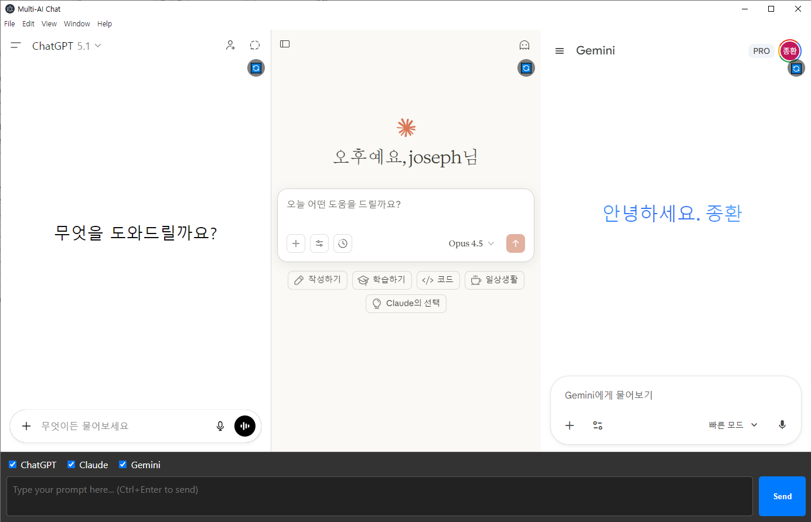

[🇺🇸 English](README.md) | [🇰🇷 한국어](README.ko.md) | [🇯🇵 日本語](README.ja.md)

# Sync Multi Chat

**Sync Multi Chat** (코드명: MAPB - Multi AI Prompt Broadcaster)은 여러 AI 서비스를 동시에 사용하는 사용자들의 생산성을 극대화하기 위해 설계된 Electron 기반 데스크톱 애플리케이션입니다.
단 하나의 프롬프트를 **ChatGPT**, **Claude**, **Gemini**, **Grok**, **Perplexity**에 동시에 전송하고, 답변을 나란히 표시하여 쉽게 비교할 수 있도록 해줍니다.


*그림 1: ChatGPT, Claude, Gemini와 동시에 상호작용하는 Sync Multi Chat 인터페이스*

## 주요 기능

-   **멀티 패널 인터페이스**: 최대 4개의 AI 서비스(ChatGPT, Claude, Gemini, Grok, Perplexity)를 그리드 레이아웃에서 동시에 보고 상호작용할 수 있습니다.
-   **동시 프롬프트 전송**: 중앙의 "마스터 입력창"에서 메시지를 보내면 활성화된 모든 AI 서비스에 즉시 전송됩니다.
-   **폭넓은 서비스 지원**: ChatGPT, Claude, Gemini, Grok (xAI), Perplexity, **Genspark**를 지원합니다.
-   **채팅 기록 관리**: 활성화된 서비스, 레이아웃, URL을 포함한 전체 채팅 세션을 저장하고 복원할 수 있습니다.
-   **대화 기록 (History)**: 사이드바에서 과거 세션에 접근하여 즉시 복원할 수 있습니다.
-   **줌 및 레이아웃 제어**: 텍스트 크기를 조절하고 2x2, 1x3, 1x4, 최대화 레이아웃 간에 전환할 수 있습니다.
-   **프롬프트 히스토리**: 자주 사용하는 프롬프트를 저장하고 재사용할 수 있습니다.
-   **크로스 체크 (Cross Check)**: 한 AI의 답변을 다른 AI들에게 새로운 프롬프트로 보내 상호 검증(반복 개선)할 수 있습니다.

## 기술 스택

-   **Electron**: 크로스 플랫폼 데스크톱 애플리케이션 프레임워크.
-   **Puppeteer**: 웹 뷰와 상호작용을 자동화하기 위한 Headless Chrome Node.js API.
-   **Vanilla HTML/CSS/JS**: 가볍고 빠른 프론트엔드.

## 버전

-   **현재 버전**: v0.5.12

## 설치 방법

이 애플리케이션은 **Windows 설치 프로그램**으로 배포되며, **자동 업데이트 기능**을 지원합니다.

1.  최신 설치 파일을 다운로드합니다: [Sync-Multi-Chat-Setup-0.5.12.exe](https://github.com/cccnam5158/sync-multi-chat/releases/download/v0.5.12/Sync-Multi-Chat-Setup-0.5.12.exe)
2.  설치 프로그램을 실행하고 설치 마법사를 따라 진행합니다.
3.  앱은 시작 시 자동으로 업데이트를 확인합니다.

### 개발 환경 설정 (기여자용)

1.  저장소를 클론(Clone)합니다.
2.  `npm install`을 실행하여 의존성을 설치합니다.
3.  `npm start`를 실행하여 개발 모드에서 애플리케이션을 시작합니다.

## 아키텍처 및 디자인

-   **프로젝트명**: Sync Multi Chat
-   **채팅 스레드 복사 (Copy Chat Thread)**: 모든 채팅 스레드를 마크다운 서식을 유지한 채 클립보드로 한 번에 복사합니다.
-   **마지막 응답 복사 (Copy Last Response)**: 빠른 비교를 위해 활성화된 모든 서비스의 마지막 AI 응답만 복사합니다.
-   **크로스 체크 (Cross Check)**: "Cross Check" 버튼을 클릭하면 각 AI가 다른 AI들의 답변을 검토하게 합니다.
-   **익명 크로스 체크 (Anonymous Cross Check)**: 편향을 줄이기 위해 크로스 체크 중 AI 서비스 이름을 익명(A, B, C...)으로 숨기는 옵션입니다.
-   **파일 업로드**: 이미지나 텍스트 파일을 프롬프트에 첨부하여 지원되는 모든 서비스에 브로드캐스트합니다. **드래그 앤 드롭** 및 **클립보드 붙여넣기**를 지원합니다.

-   **샌드박스 환경**: 각 서비스는 격리된 컨텍스트(context isolation)를 가진 `BrowserView`에서 실행됩니다.
-   **자격 증명 미저장**: 비밀번호는 앱에 절대 저장되지 않습니다. 각 서비스의 공식 웹사이트를 통해 직접 로그인합니다.
-   **봇 탐지 우회**: 호환성을 보장하기 위해 User-Agent 스푸핑 및 사람과 유사한 입력 이벤트 트리거를 사용합니다.

---

## 📦 설치 및 시작하기

### 필수 요구 사항
-   [Node.js](https://nodejs.org/) (v16 이상 권장)
-   [npm](https://www.npmjs.com/) (보통 Node.js와 함께 설치됨)

### 설치 단계

1.  **저장소 클론**
    ```bash
    git clone https://github.com/your-username/sync-multi-chat.git
    cd sync-multi-chat
    ```

2.  **의존성 설치**
    ```bash
    npm install
    ```

3.  **애플리케이션 실행**
    ```bash
    npm start
    ```

4.  **프로덕션 빌드**
    
    자동 업데이트 기능이 포함된 setup.exe 설치 프로그램을 생성합니다.
    ```bash
    npm run build
    ```
    설치 프로그램은 `dist` 폴더에 생성됩니다.

---

## 📖 사용 가이드

1.  **초기 설정**: 앱을 처음 실행하면 각 패널에 ChatGPT, Claude, Gemini 등의 로그인 화면이 나타납니다. 각 서비스에 수동으로 **로그인**해주세요.
2.  **프롬프트 브로드캐스팅**:
    -   하단의 입력창에 질문을 입력하세요.
    -   **Enter**를 누르거나 전송 버튼을 클릭하여 활성화된 모든 서비스에 메시지를 보냅니다.
    -   **Ctrl+Enter**를 사용하여 강제 전송을 할 수 있습니다.
    -   **Ctrl+Shift+Enter**를 사용하거나 **New Chat** 버튼을 클릭하여 모든 활성 패널에서 새 대화를 시작합니다.
3.  **고급 기능**:
    -   **Copy Chat Thread**: **Copy Chat Thread** 버튼을 클릭하여 활성화된 모든 패널의 전체 대화 기록을 마크다운 서식으로 클립보드에 복사합니다.
    -   **Copy Last Response**: **Copy Last Response** 버튼을 클릭하여 각 활성 서비스의 마지막 AI 응답만 복사합니다.
    -   **Cross Check**: **Cross Check** 버튼을 클릭하여 각 AI가 다른 AI들의 답변을 검토하게 합니다.
    -   **서비스별 헤더**: 각 패널에는 서비스 이름과 빠른 액세스 버튼이 있는 헤더 바가 있습니다:
        -   🔄 **Reload**: 해당 서비스 패널만 새로고침합니다.
        -   📋 **Copy**: 해당 서비스의 전체 채팅 스레드를 마크다운 서식으로 복사합니다.
4.  **파일 업로드**:
    -   **파일 첨부**: **클립(Clip)** 아이콘을 클릭하거나 파일을 입력 영역으로 **드래그 앤 드롭**하세요.
    -   **이미지 붙여넣기**: 클립보드에서 이미지를 직접 붙여넣으세요.
    -   **2단계 전송**: 파일이 첨부된 상태에서 Enter를 누르면 업로드가 시작됩니다. 확인 모달이 뜨면 **Ctrl+Enter**를 다시 눌러 파일과 함께 프롬프트를 전송하세요.

## 로드맵

### 1단계 (완료)
-   [x] 기본 멀티 뷰 아키텍처
-   [x] 프롬프트 브로드캐스팅
-   [x] 채팅 스레드 복사 (Copy Chat Thread)
-   [x] 크로스 체크 (답변 상호 참조)
-   [ ] 응답 완료 감지
-   [ ] 에러 처리 및 복구

### 2단계 (진행 중)
-   [x] 추가 서비스 지원 (Grok, Perplexity)
-   [x] 고급 레이아웃 (2x2, 크기 조절 가능)
-   [x] 파일 업로드 (드래그 앤 드롭, 붙여넣기, 멀티 서비스) *Grok 일시 비활성화*
-   [x] 로컬 대화 기록 (History)
-   DeepSeek, Copilot 지원
-   응답 비교 도구 (Diff 뷰)
-   응답 복사/저장 기능 (강화됨)

### 3단계 (예정)
-   프롬프트 템플릿
-   응답 품질 분석

---

## 🤝 기여하기

기여는 언제나 환영합니다! 다음 단계를 따라주세요:

1.  프로젝트를 포크(Fork)합니다.
2.  기능 브랜치를 생성합니다 (`git checkout -b feature/AmazingFeature`).
3.  변경 사항을 커밋합니다 (`git commit -m 'Add some AmazingFeature'`).
4.  브랜치에 푸시합니다 (`git push origin feature/AmazingFeature`).
5.  Pull Request를 엽니다.

---

## 📄 라이선스

이 프로젝트는 **Polyform Noncommercial License 1.0.0** 하에 라이선스됩니다. 자세한 내용은 [LICENSE](LICENSE) 파일을 참조하세요.

이 라이선스는 다음을 허용합니다:
*   **개인적 사용**: 개인적인 필요를 위해 이 소프트웨어를 자유롭게 사용할 수 있습니다.
*   **비상업적 사용**: 비영리 및 비상업적 목적으로 이 소프트웨어를 자유롭게 사용할 수 있습니다.

이 라이선스는 다음을 **금지**합니다:
*   **상업적 사용**: 비즈니스 운영, 부분 유료화(freemium) 서비스의 일부로 제공, 또는 금전적 보상이나 상업적 이익을 주된 목적으로 하는 모든 활동에 이 소프트웨어를 사용할 수 없습니다.

```text
Copyright (c) 2025 Joseph Nam. All rights reserved.
```
