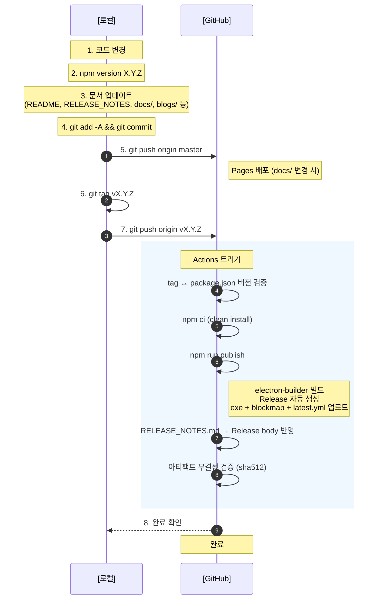

# Release Procedure

Sync Multi Chat 앱 릴리즈 배포 절차입니다.

> **원칙**: 로컬에서는 빌드/릴리즈를 생성하지 않습니다. GitHub Actions가 tag push를 감지하여 clean 환경에서 빌드 → Release 생성 → 아티팩트 업로드를 원자적으로 처리합니다.

---

## 릴리즈 흐름



---

## 단계별 상세

### 1. 코드 변경

기능 구현, 버그 수정 등 코드 작업을 완료합니다.

### 2. 버전 범프

```bash
npm version X.Y.Z --no-git-tag-version
```

`package.json`과 `package-lock.json` 모두 업데이트됩니다.
`--no-git-tag-version`으로 자동 tag 생성을 방지합니다.

### 3. 문서 업데이트

| 파일 | 내용 |
|------|------|
| `RELEASE_NOTES.md` | 최상단에 새 버전 섹션 추가 |
| `README.md` | 버전 번호, 다운로드 링크, 기능 설명 |
| `README.ko.md` | 한국어 동일 업데이트 |
| `README.ja.md` | 일본어 동일 업데이트 |
| `docs/index.html` | 버전 배지, 다운로드 링크 |
| `docs/release_notes.html` | 타임라인 항목 추가 |
| `docs/i18n.js` | 다국어(EN/KO/JA) 키 추가 |
| `src/renderer/index.html` | 앱 타이틀 버전 |
| `blogs/` | 블로그 포스팅 작성 |

### 4. 커밋

```bash
git add -A
git commit -m "release: vX.Y.Z - <변경 요약>"
```

### 5. Push (master)

```bash
git push origin master
```

이 시점에서 `docs/` 변경이 있으면 GitHub Pages가 자동 배포됩니다.

### 6~7. Tag 생성 및 Push

```bash
git tag vX.Y.Z
git push origin vX.Y.Z
```

이 시점에서 GitHub Actions `Build and Release` 워크플로우가 자동 트리거됩니다.

### 8. 완료 확인

- [GitHub Actions](https://github.com/cccnam5158/sync-multi-chat/actions) 에서 워크플로우 성공 확인
- [Releases](https://github.com/cccnam5158/sync-multi-chat/releases) 페이지에서 아티팩트 확인
- [GitHub Pages](https://cccnam5158.github.io/sync-multi-chat/) 에서 docs 반영 확인

---

## 하지 말아야 할 것

| 금지 사항 | 이유 |
|-----------|------|
| 로컬에서 `npm run build:win` 후 `gh release create`로 업로드 | Actions와 이중 빌드 → hash 불일치 위험 |
| `gh release create`로 Release 선생성 | Actions의 `--publish always`와 충돌 (overwrite) |
| tag 없이 Release 수동 생성 | Actions 트리거 안 됨, 아티팩트 누락 |

---

## 로컬 빌드가 필요한 경우

테스트/디버깅 목적으로 로컬 빌드가 필요하면:

```bash
npm run build:win     # --publish 없음, 로컬에만 dist/ 생성
```

빌드된 exe는 `dist/` 폴더에 생성되지만 **GitHub에 업로드하지 않습니다**.

---

## GitHub Actions 안전장치

워크플로우에 다음 검증 단계가 포함되어 있습니다:

1. **Tag-Package 버전 일치 검증**: tag 버전과 `package.json` 버전이 다르면 빌드 중단
2. **Release notes 자동 반영**: `RELEASE_NOTES.md`에서 해당 버전 섹션을 추출하여 Release body에 반영
3. **아티팩트 무결성 검증**: 빌드 후 sha512 해시를 로그에 출력하여 `latest.yml`과 대조 가능

---

## Troubleshooting

### Actions가 트리거되지 않는 경우

tag가 올바르게 push되었는지 확인:

```bash
git tag -l 'v*'              # 로컬 tag 목록
git ls-remote --tags origin  # 원격 tag 목록
```

### Hash mismatch로 자동 업데이트 실패

1. Release 페이지에서 `latest.yml` 다운로드
2. `sha512` 값과 실제 exe의 해시 비교
3. 불일치 시 Release 삭제 후 tag 재push로 Actions 재실행

```bash
gh release delete vX.Y.Z --yes
git push origin :refs/tags/vX.Y.Z  # 원격 tag 삭제
git tag -d vX.Y.Z                  # 로컬 tag 삭제
git tag vX.Y.Z                     # tag 재생성
git push origin vX.Y.Z             # 재push → Actions 재트리거
```
