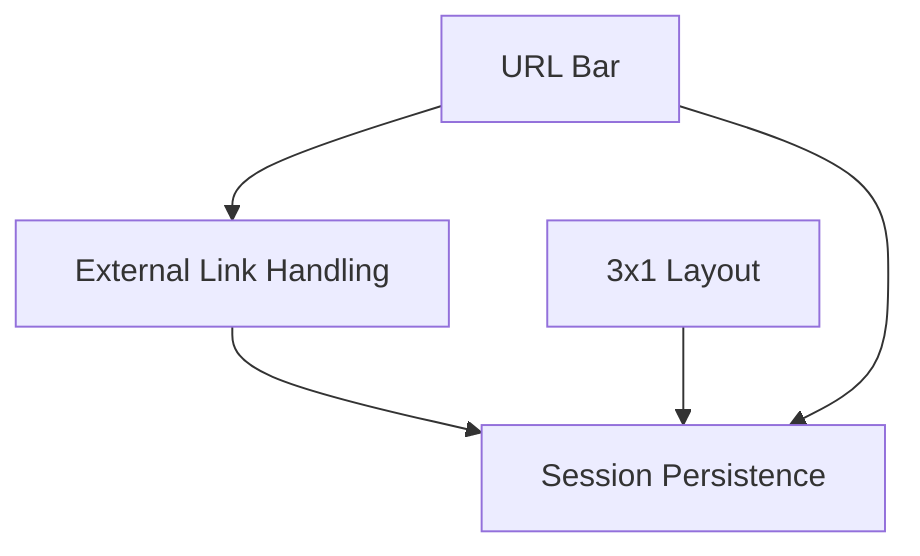

# Session Persistence & UI Enhancement Features

## 1. Overview
This document outlines the implementation of four new features to enhance the Multi-AI Chat application:
1. **Session Persistence**: Save and restore application state across sessions
2. **WebView URL Bar**: Add URL display and action bar to each webview panel
3. **3x1 Layout & Layout Conditions**: Add 3x1 layout option and conditional button enablement
4. **External Link Handling**: Open clicked links in native Chrome browser

## 2. User Requirements

### 2.1 Feature 1: Session Persistence (세션 영속성)

#### 2.1.1 Saved State
When the application closes, the system shall save the following state:
- **WebView URLs**: Current URL loaded in each BrowserView (not just home URL)
- **Layout Configuration**: Currently selected layout mode (1x3, 3x1, 4x1, 2x2)
- **User Control States**:
  - Anonymous mode button state (ON/OFF)
  - Scroll Sync toggle state (ON/OFF)
  - Currently selected layout button
  - Active AI services (toggles for ChatGPT, Claude, Gemini, Grok, Perplexity)

#### 2.1.2 State Restoration
When the application launches:
- Restore all saved state from previous session
- Load webviews with their previously opened URLs
- Apply saved layout configuration
- Restore all toggle/button states

#### 2.1.3 Storage
- Store session state in `electron-store` or localStorage
- Use JSON format for easy serialization/deserialization
- Handle missing/corrupted state gracefully with defaults

---

### 2.2 Feature 2: WebView URL Bar (웹 뷰 URL 바)

#### 2.2.1 UI Design
- Add a new row below the existing service header bar in each panel
- Light background color (e.g., `rgba(255, 255, 255, 0.1)` or similar)
- Height: approximately 24-28px
- Layout: `[URL Text] [Copy Icon] [Chrome Icon]`

#### 2.2.2 URL Display
- Display current webview URL as text (read-only)
- Truncate long URLs with ellipsis if needed
- Update URL in real-time as webview navigates

#### 2.2.3 Copy Button (복사 아이콘)
- 📋 or similar copy icon
- On click: Copy current URL to system clipboard
- Show brief visual feedback (e.g., icon change or tooltip)

#### 2.2.4 Open in Chrome Button (Chrome 아이콘)
- 🌐 or Chrome-like icon
- On click: Open current URL in system default browser (Chrome)
- Use Electron's `shell.openExternal()` API

---

### 2.3 Feature 3: 3x1 Layout & Layout Conditions (3x1 레이아웃 및 조건)

#### 2.3.1 New Layout Option
- Add "3x1" layout button to existing layout controls
- Button order: **1x3, 3x1, 4x1, 2x2** (left to right)
- 3x1 layout: 3 vertical rows stacked horizontally (side-by-side)

#### 2.3.2 Layout Button Conditions
- Layout selection buttons shall be **disabled** when fewer than 3 webviews are active
- Visual indication of disabled state (grayed out, cursor: not-allowed)
- When disabled, buttons should not respond to clicks

#### 2.3.3 Layout Behavior
| Layout | Description |
|--------|-------------|
| 1x3 | 1 column × 3 rows (vertical stack) |
| 3x1 | 3 columns × 1 row (horizontal) |
| 4x1 | 4 columns × 1 row (horizontal) |
| 2x2 | 2 columns × 2 rows (grid) |

---

### 2.4 Feature 4: External Link Handling (외부 링크 처리)

#### 2.4.1 Link Click Behavior
- When a user clicks any link (`<a>` tag) inside a webview that would navigate away from the current AI service domain
- Open the link in native Chrome browser instead of in the webview
- Keep the webview on its current page

#### 2.4.2 Domain Detection
- Detect if clicked link URL is different from the current service's primary domain
- Service domains:
  - ChatGPT: `chatgpt.com`, `chat.openai.com`, `openai.com`
  - Claude: `claude.ai`, `anthropic.com`
  - Gemini: `gemini.google.com`, `google.com` (carefully handle)
  - Grok: `grok.com`, `x.com`, `twitter.com`
  - Perplexity: `perplexity.ai`

#### 2.4.3 Implementation
- Use `will-navigate` or `new-window` events on BrowserView's webContents
- Use `shell.openExternal(url)` to open in system browser
- Prevent default navigation within the webview

---

## 3. Technical Architecture

### 3.1 Session Persistence

#### 3.1.1 Components Affected
- **Main Process (`main.js`)**: State saving on app quit, state restoration on app ready
- **Renderer (`renderer.js`)**: Send state to main process, receive initial state

#### 3.1.2 State Schema
```json
{
  "version": 1,
  "savedAt": "ISO8601 timestamp",
  "webViews": {
    "chatgpt": { "url": "https://chatgpt.com/c/abc123", "active": true },
    "claude": { "url": "https://claude.ai/chat/xyz456", "active": true },
    "gemini": { "url": "https://gemini.google.com/app", "active": true },
    "grok": { "url": "https://grok.com", "active": false },
    "perplexity": { "url": "https://perplexity.ai", "active": true }
  },
  "layout": "2x2",
  "controls": {
    "anonymousMode": false,
    "scrollSync": true,
    "activeServices": ["chatgpt", "claude", "gemini", "perplexity"]
  }
}
```

#### 3.1.3 Storage Location
- Use `electron-store` package (already in dependencies)
- Key: `sessionState`

### 3.2 WebView URL Bar

#### 3.2.1 Components Affected
- **Main Process (`main.js`)**: IPC handler for current URL request, open-external handler
- **Renderer (`renderer.js`)**: Create URL bar HTML, handle copy/open actions
- **Styles (`styles.css`)**: URL bar styling

#### 3.2.2 IPC Events
- `get-webview-url`: Request current URL from a specific webview
- `webview-url-changed`: Notify renderer of URL change
- `open-in-chrome`: Open URL in external browser
- `copy-url-to-clipboard`: Copy URL using clipboard API

### 3.3 Layout Enhancements

#### 3.3.1 Components Affected
- **Renderer (`renderer.js`)**: Add 3x1 layout logic, update layout button conditions
- **Styles (`styles.css`)**: 3x1 layout grid CSS, disabled button styles
- **HTML (`index.html`)**: Add 3x1 layout button

#### 3.3.2 Layout Grid CSS
```css
.layout-3x1 {
    grid-template-columns: repeat(3, 1fr);
    grid-template-rows: 1fr;
}
```

### 3.4 External Link Handling

#### 3.4.1 Components Affected
- **Main Process (`main.js`)**: Add will-navigate and new-window event handlers to BrowserViews

#### 3.4.2 Domain Whitelist
```javascript
const serviceDomains = {
    chatgpt: ['chatgpt.com', 'chat.openai.com', 'openai.com', 'auth0.com'],
    claude: ['claude.ai', 'anthropic.com'],
    gemini: ['gemini.google.com', 'google.com', 'accounts.google.com'],
    grok: ['grok.com', 'x.com', 'twitter.com'],
    perplexity: ['perplexity.ai']
};
```

---

## 4. Implementation Priority & Dependencies

### 4.1 Priority Order

| Priority | Feature | Reason |
|----------|---------|--------|
| 1 | Feature 4: External Link Handling | No dependencies, isolated change |
| 2 | Feature 3: 3x1 Layout & Conditions | Foundation for session persistence |
| 3 | Feature 2: WebView URL Bar | Requires URL tracking which helps Feature 1 |
| 4 | Feature 1: Session Persistence | Depends on layout & URL tracking |

### 4.2 Dependencies



---

## 5. Implementation Steps

### Phase 1: External Link Handling
1. Add `will-navigate` event listener to each BrowserView
2. Add `new-window` event listener for `target="_blank"` links
3. Implement domain whitelist checking logic
4. Use `shell.openExternal()` for external URLs

### Phase 2: 3x1 Layout & Conditions
1. Add 3x1 layout button to `index.html`
2. Update button order (1x3, 3x1, 4x1, 2x2)
3. Add 3x1 grid CSS to `styles.css`
4. Implement `renderLayout()` logic for 3x1
5. Add `updateLayoutButtonState()` function
6. Disable layout buttons when `activeServiceKeys.length < 3`

### Phase 3: WebView URL Bar
1. Modify `createSlot()` in `renderer.js` to add URL bar row
2. Add URL bar styling in `styles.css`
3. Add IPC handlers for URL tracking in `main.js`
4. Implement copy-to-clipboard functionality
5. Implement open-in-chrome functionality
6. Listen for `did-navigate` events to update URL display

### Phase 4: Session Persistence
1. Define session state schema
2. Add state saving logic on `before-quit` event
3. Add state restoration logic on app ready
4. Send initial state to renderer via IPC
5. Update controls to send state changes to main process
6. Test state persistence across restarts

---

## 6. Constraints & Considerations

### 6.1 Technical Constraints
- Electron security: Must maintain `contextIsolation: true`
- BrowserView URL access requires `webContents.getURL()`
- Google domains are shared; careful handling needed for Gemini

### 6.2 UX Considerations
- URL bar should not take too much vertical space
- Layout buttons should clearly indicate disabled state
- First launch should use sensible defaults

### 6.3 Backward Compatibility
- Handle missing session state file gracefully
- Migrate state schema if version changes

---

## 7. Verification Plan

### 7.1 Manual Testing
- [ ] Close app, reopen → Verify all state is restored
- [ ] URL bar displays correct URL for each webview
- [ ] Copy button copies URL to clipboard
- [ ] Chrome button opens URL in external browser
- [ ] 3x1 layout arranges 3 panels horizontally
- [ ] Layout buttons disabled with < 3 active services
- [ ] Clicking external links opens in Chrome, not webview

### 7.2 Edge Cases
- [ ] App crash recovery (no state saved)
- [ ] Invalid/corrupted state file
- [ ] All services disabled then re-enabled
- [ ] URL with special characters

---

## 8. Implementation Date
**Planned**: 2025-12-09
**Version**: v0.6.0 (target)
